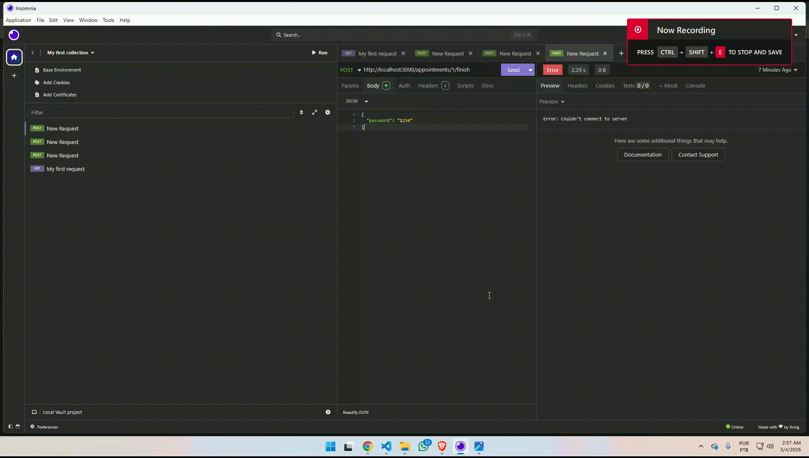

# Backend Web com Haskell+Scotty
## 1 Identificação
- Nome: Samuel Souza
- Curso: Sistemas de informação

## 2 - Tema/objetivo
 O trabalho tem o objetivo de facilitar o gerenciamento de uma lavanderia. Existe a visão do usuário e o admin, porém não foi feito autenticação nem tabela de usúario. Como eu fiz uma api, role do usuário e o customerId são passados pelo body da requisição. 
 O usuário pode ver a lista de agendamentos, caso ele seja admin ele poderá ver tods os agendamentos, caso não ele irá visualizar somente os próprios agendamentos. É possivel criar e remover agendamentos, filtrar por agendamentos. O cliente também tem a possibilidade
 de entrar em uma lista de espera para que caso alguém não compareça, o horário seja dado. É similar com a fila de agendamento do RU.

 ## 3 Processo de desenvolvimento.

 Bem eu começei preparando o ambiente de desenvolvimento, então criei um Dockerfile e um docker-compose. Minha ideia inicial era criar um mini-framework similar ao java spring, mas estava muito complicado então eu desiti da ideia. Então fiz algo mais simples. 
 Basicamente a main serve para startar o servidor e chamar o createApp, que vai ser responsavel por mapear as rotas e criar a conexão com o banco de dados. Por exemplo nesse trecho de código do App.hs:
 ``` 
routes :: App -> ScottyM ()
routes app = do
  AppointmentRoutes.routes app
  WaitingQueueRoutes.routes app
  ```

Toda vez que eu crio um novo arquivo de rora eu preciso adicionar ele aqui, isso me deixou bastante frutrado porque eu queria fazer de uma forma que bastasse eu colocar a rota no Web.hs e automaticamente fazer o "mini-framework" por baixo do panos iria fazer o 
bind da rota.
Minha estrutura de codigo ficou da seguinte maneira:

## Estrutura do Projeto

- laundry-api:
- app
  - Models -> Aqui fica as entidades da aplicação
  - Service --> Camada da regra de negocios
  - Handler -> Seria o controller, porém no haskell o padrão usado é handler
  - DTO  ->    Aqui eu só usei o dto corretamente na criação de agendamentos, de resto eu retornada as entidades mesmo. 
  - Database -> Aqui vai ficar o arquivo de conexão com o banco e a criação de tabelas. 
  - Routes -> Aqui é são colocados os arquivos de rota
  - Utils - Helpers
  - Repositories -> camda responsavel por integir com o banco dados, nesse caso estou usando Sqlite
  - App.hs -> responsavel por abrir a conexão com o banco e mapear as rotas 
  - Main.hs -> startar o servidor
  - Web.hs -> rotas, poderia ficar dentro de routes também, mas deixei aqui. O nome é web porque as requisições vem da web, se fossem rotas de api, seria Api.hs. 
- test

Eu não fiz tantos commits assim porque normalmente no meu dia a dia eu faço commit por tasks, não sei se é a melhor prática ou não, mas enfim então tenho a mania de fazer menos commits eu fui fazendo commits conforme eu terminava uma task. 
```
createAppointmentHandler :: App -> ActionM ()
createAppointmentHandler app = do
  appointment <- jsonData :: ActionM CreateAppointmentRequest

  result <- liftIO $
    AppointmentService.createAppointment app appointment

  case result of
    Left message -> do
      status HTTP.status409
      json message

    Right createdAppointment -> do
      status HTTP.status201
      json createdAppointment
```
Primeiro eu começei fazendo a função de criação de agendamentos, isso me obrigou a criar um controller, um service e um repository, alem de criar uma entidade, que depois iria virar um dto, minha principal dificuldade foi só entender como eu iria tarabalhar com json 
no haskell, eu fiz pesquisa na internet, descobri sobre a aeson library, também li um post no reddit que mostava o parseamento de um json e haskell e vi no exemplos no chatGPT, fiz bastentes peguntas para ele e tirei sobre como funciona tal coisa e pedi 
dicas de arquitetura. A parte de criação, listagem e exclusão foi bem tranquila. Essa função ela poderia ser mellhorada no quesito de tratamento de erro, se der outro status de erro a mensagem para o usuário não seria clara. Ela só trata o caso de
duplicão de agendameno, por isso o 409. 

```
listAppointments :: App -> Query.AppointmentQuery -> IO [Appointment.Appointment]
listAppointments app filters =
  if Query.isAdmin filters
    then AppointmentRepository.findAppointments (appDb app) filters
    else case Query.customerId filters of
      Just _ ->
        AppointmentRepository.findAppointments (appDb app) filters

      Nothing ->
        pure []

```

Tem tambpem a função de listagem de agendamentos, seria todos os seus agendamentos. Eu usei uma função só listagem, por isso tem o parâmetro isAdmin, caso seja o admin ele irá ver todos os agendamentos senão ele irá somente ver os próprios agendamentos. Nessa situação 
como eu só obrigado a deixar o customerId opcinal tive que colocar um jus/nothing para caso o não seja admin e não tenha customer entre no nothing e retorne um array vazio. Tem mais duas funções de delete e udpate, mas não vejo nada de relevante para comentar sobre elas.

A parte mais legal e desafiadora foi a lista de espera. Primeiro vamos entender o fluxo.  Existem essas duas funções, uma serve para o usuário entrar na lista de espera e a outra para fazer a checagem para saber se algum horário ficou vago

```
joinQueue :: App -> Queue.WaitingQueue -> IO ()
joinQueue app queue =
  WaitingQueueRepository.insertQueue (appDb app) queue

checkDelayAndReleaseQueue :: App -> IO ()
checkDelayAndReleaseQueue app = do
  now <- getZonedTime
  checkDelayAndReleaseQueueAt app now
```

Em um mundo ideal, a checkDelayAndReleaseQueue era pra estar em uma cron que chama a função de tempos em tempos, eu até vi que tem uma biblioteca de cron do Hackage,mas eu tinha muito pouco tempo pra desenvolver esse trabalho a até eu pesquisar,
entender e implementar iria demorar muito mais tempo, então a função precisa ser chamada via api para ela fazer a verificação de horário e liberar espaço na fila de agendamentos.  De ínicio eu começei passando o time direto no body da requisição, porém iso não era o ideal 
então eu criei um array com a grade de horários
```
appointmentSlots :: [TimeRange]
appointmentSlots =
  [ ("08:00", "09:08")
  , ("09:08", "10:08")
  , ("10:08", "11:08")
  , ("11:08", "12:08")
  , ("12:08", "13:08")
  , ("13:08", "14:08")
  , ("14:08", "15:08")
  , ("15:08", "16:08")
  , ("16:08", "17:08")
  ]
```
Então ele verifica a data atual e horário e faz uma busca dentro do array para saber em qual intervalo a hora está e se a hora atual é maior que a hora atual mais o tempo de tolerância que é 8 minutos. 

```
findCurrentSlot :: Int -> Maybe TimeRange
findCurrentSlot currentMinute =
  find isInside appointmentSlots
  where
    isInside (startTime, endTime) =
      let start = minutesFromTimeOfDay (stringToTimeOfDay startTime)
          end = minutesFromTimeOfDay (stringToTimeOfDay endTime)
          releaseAfter = start + delayToleranceMinutes
       in currentMinute >= releaseAfter && currentMinute < end

```

Todos os horários de fim de fim terminam em 8, exemplo: ("08:00", "09:08"). Isso é para que qyem conseguu entrar na fila de espera 8 min depois não tenha menos tempo de maquina nem conflitar horário com a lavagem da próxima pessoa. Eu dos problemas que eu tive nessa parte era que o horário do haskell estava
em UTC então a data nunca batia. O que eu fiz foi colocar no docker compose "America/sao paulo". Outro ponto de atenção foi que de ínicio eu não criei a coluna status para agendamento, fui obrigado a criar porque a query trazia todos os agendamentos daquele horário. 
Adicionei a verifição para só pegar agendamentos com status scheduled

```
findScheduledAppointmentsByScheduledAt :: Connection -> String -> IO [Appointment]
findScheduledAppointmentsByScheduledAt conn scheduledAt =
  query conn
    "SELECT id, customer_id, scheduled_at, machine, password, status \
    \FROM appointments \
    \WHERE scheduled_at = ? AND status = 'scheduled'"
    (Only scheduledAt)
```

## Check-in
```

checkInAppointmentHandler :: App -> ActionM ()
checkInAppointmentHandler app = do
  appointmentId <- captureParam "id"
  req <- jsonData :: ActionM CheckInReq.CheckInRequest

  result <- liftIO $
    AppointmentService.updateAppointmentStatus
      app
      appointmentId
      (CheckInReq.password req)
      "checked_in"

  handleStatusResult result

finishAppointmentHandler :: App -> ActionM ()
finishAppointmentHandler app = do
  appointmentId <- captureParam "id"
  req <- jsonData :: ActionM CheckInReq.CheckInRequest

  result <- liftIO $
    AppointmentService.updateAppointmentStatus
      app
      appointmentId
      (CheckInReq.password req)
      "finished"

  handleStatusResult result
```

Também tem a parte do check-in, quando o usuário vai usar a maquina ele irá precisar colocar um senha, a senha padrão é 1234, e caso a senha esteja correta ele ira atualizar o status do agenddamento para check_in. Quando ele retira as roupas ele precisa colocar a 
mesma senha e o status vai pra finished. referente a questão de erros, ocorreram muitos porém eu não tirei print de todos e estão com pouco contexto, mas vou colocar o print de um exemplo


Esse erro ocorre porque várias vezes eu chamava duas entidades com os mesmos atribuitos, então o haskell não conseguia saber de qual lugar ele deveria pegar a informação. Acho que é isso basicamente eu o que eu tenho pra falar.


## Orientações para execução

### Pré-requisitos para rodar localmente

Antes de iniciar, você precisa ter instalado:

* Docker
* Docker Compose

---
Na raiz do projeto, execute:

```bash
docker compose up --build -d
```

Esse comando irá:

* **--build**: construir a imagem do zero (necessário na primeira vez ou após alterações)
* **-d**: rodar os containers em background

---

## URL

```
http://localhost:3000 ou  https://perso-2026a-samue345.onrender.com/
```

---

## Rotas da API

### Agendamentos

---

### Criar agendamento

```
POST /appointments
```

#### Body

```json
{
  "customerId": 1,
  "scheduledAt": "2026-05-04 08:00:00",
  "machine": 1
}
```

#### Parâmetros
```
{ 
  CustomerId: required, 
  machine: required 
  scheduledAt: required
}
```
---

### Listar agendamentos

```
GET /appointments
```

#### Query params
```
{
  customer_id: opcional,
  role: required, --> pode ser admin ou customer
  machine: opcional,
  date: opcional
}
```
---

### ➤ Deletar agendamento

```
DELETE /appointments/:id
```

#### Parâmetros de rota
```
{
  id: required
}
```
---

### Check-in no agendamento

```
POST /appointments/:id/check-in
```

#### Parâmetros de rota
```
{
  id: required
}
```

#### Body (JSON)

```json
{
  "password": "senha_gerada" -> 1234
}
```
```
{
  password: required
}
```


---

###  Finalizar agendamento

```
POST /appointments/:id/finish
```

#### Parâmetros de rota

```
{
  id: required
}
```
## Fila de espera

### Entrar na fila

```
POST /queue
```

#### Body (exemplo)

```json
{
  "customerId": 1
}
```

---

### Verificar delay/liberação

```
POST /queue/check-delay
```

## Formato de datas

Todas as datas devem seguir:

```
YYYY-MM-DD HH:MM:SS
```

Exemplo:

```
2026-05-04 08:00:00
```

---
## Resultado final:



## Referências e créditos 
  https://www.reddit.com/r/haskell/comments/10qv38v/help_with_json_parsing_in_haskell/
  https://hackage.haskell.org/package/cron
  https://hackage-content.haskell.org/package/base-4.22.0.0/docs/Data-Maybe.html
  ## Pesquisas
  Muitas vezes quando pesquisa algo, a própria ia do google (gemini) já dava a resposta. 
  Uso de LLM´s como chatGTP e gemini
